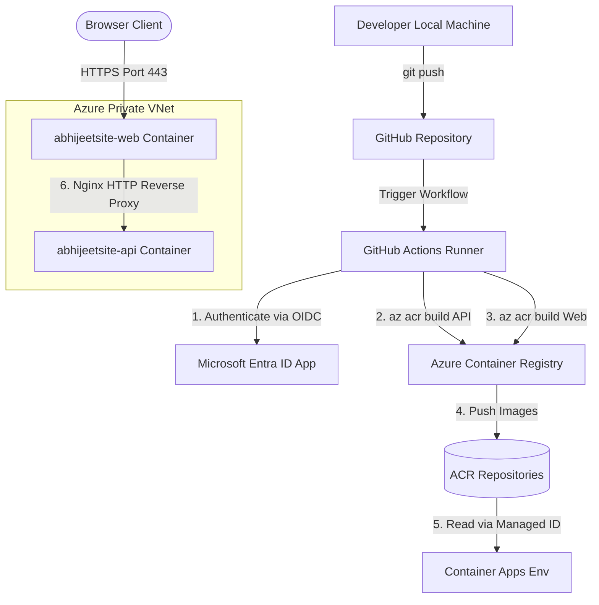

# Azure Container Apps & GitHub Actions Deployment Guide

This guide provides step-by-step instructions to configure **100% cloud-native** container building and secure deployment to **Azure Container Apps (ACA)** using **GitHub Actions CI/CD**. 

By utilizing cloud-based compilation (`az acr build`), this architecture completely eliminates any dependency on a local Docker daemon and fully bypasses local network firewall/SSL connection reset blocks.

---

## Architectural Overview



1. **Secure Identity (OIDC)**: GitHub Actions securely logs into Azure using **OpenID Connect (OIDC)**, meaning you do **not** need to store password keys or service principal secrets in GitHub.
2. **Cloud-Native Builds (`az acr build`)**: Source directories are packaged and compiled inside Azure Container Registry tasks, freeing local developer environments from running Docker or pulling heavy images.
3. **Internal Nginx Proxy**: The public frontend (`abhijeetsite-web`) reverse-proxies API requests (`/api/*`) internally over private HTTP to the backend C# API (`abhijeetsite-api`), utilizing a startup-injected `API_UPSTREAM` variable.

---

## Step 1: Create Azure Identity (App Registration)

To allow GitHub to log into your Azure subscription securely without passwords:

1. Open the [Azure Portal](https://portal.azure.com/) and go to **Microsoft Entra ID** (formerly Azure Active Directory).
2. In the left menu, select **App registrations** -> **New registration**.
   - **Name**: `github-actions-deploy`
   - **Supported account types**: Select the **first option**: `Accounts in this organizational directory only (Default Directory only - Single tenant)`.
   - Click **Register**.
3. Copy the following GUID values from the **Overview** page:
   - **Application (client) ID** (this will be `AZURE_CLIENT_ID`)
   - **Directory (tenant) ID** (this will be `AZURE_TENANT_ID`)

### Configure Federated Credentials (OIDC active trust)
This establishes the secure trust between Azure and your personal GitHub repository branch.

1. Inside your new App Registration page, click on **Certificates & secrets** in the left menu.
2. Select the **Federated credentials** tab, and click **Add credential**.
3. Fill out the form:
   - **Federated credential scenario**: `GitHub Actions deploying Azure resources`
   - **Organization**: Your personal GitHub username (e.g., `abhijeethaval`).
   - **Repository**: Your repository name (e.g., `abhijeethaval-website`).
   - **Entity type**: **Branch**
   - **Branch name**: `main`
   - **Name**: `github-main-branch`
4. Click **Add**.

---

## Step 2: Configure Azure Role Assignments (IAM)

Your GitHub identity needs permission to deploy resources inside your resource group and push to your container registry.

1. Navigate to your Resource Group **`rg-abhijeet-site`** in the Azure Portal.
2. Click on **Access control (IAM)** in the left menu, then click **Add** -> **Add role assignment**.
3. **Locate the generic Contributor role**:
   > [!IMPORTANT]
   > Azure groups powerful administrator roles into a separate tab to prevent accidental assignments.
   > - Click on the **`Privileged administrator roles`** tab at the top of the roles list.
   > - Select the plain **`Contributor`** role.
4. Click **Next**, and choose **Assign access to**: `User, group, or service principal`.
5. Click **+ Select members**, search for `github-actions-deploy` (your app registration), select it, and click **Select**.
6. Click **Review + assign**.
7. Navigate to your Container Registry **`acrabhijeetsite`** (or do it at the Resource Group level) and repeat the process to assign the **`AcrPush`** role to `github-actions-deploy` so it can push container images.

---

## Step 3: Configure GitHub Secrets & Variables

Navigate to your repository on **GitHub.com**, click **Settings** -> **Secrets and variables** -> **Actions**.

### 1. Add Secrets (Sensitive Connection IDs)
Under the **Secrets** tab, click **New repository secret** for:

| Secret Name | Value |
| :--- | :--- |
| **`AZURE_CLIENT_ID`** | The **Application (client) ID** copied in Step 1 |
| **`AZURE_TENANT_ID`** | The **Directory (tenant) ID** copied in Step 1 |
| **`AZURE_SUBSCRIPTION_ID`** | Your Azure Subscription ID (found on your Resource Group page) |

### 2. Add Variables (Non-sensitive resource settings)
Click the **Variables** tab (next to Secrets), and click **New repository variable** for:

| Variable Name | Value | Description |
| :--- | :--- | :--- |
| **`RESOURCE_GROUP`** | `rg-abhijeet-site` | The Azure Resource Group name |
| **`ACR_NAME`** | `acrabhijeetsite` | Your Container Registry name |
| **`ACR_LOGIN_SERVER`** | `acrabhijeetsite.azurecr.io` | Registry login server |
| **`WEB_APP`** | `abhijeetsite-web` | Image repository name for the Web App |

---

## Step 4: Configure Container Apps (In the Azure Portal)

To allow the frontend Web container to securely talk to the backend C# API internally over the private virtual network:

### 1. API App Ingress (`abhijeetsite-api`)
1. Go to your **`abhijeetsite-api`** Container App in the portal.
2. In the left menu, under **Settings**, click on **Ingress**.
3. Configure:
   - **Ingress**: `Enabled`
   - **Ingress traffic**: `Limited to Container Apps Environment` (Internal)
   - **Target Port**: **`8080`** (the port the C# API listens on internally)
   - **Transport**: `Auto`
4. Click **Save**.
5. Copy the generated **Application URL** (FQDN) from the Overview page. E.g., `http://abhijeetsite-api.internal.aca-env-abhijeet-site.centralindia.azurecontainerapps.io`

### 2. Web App Ingress (`abhijeetsite-web`)
1. Go to your **`abhijeetsite-web`** Container App in the portal.
2. In the left menu, click **Ingress**.
3. Configure:
   - **Ingress**: `Enabled`
   - **Ingress traffic**: `Accepting traffic from anywhere` (External/Public)
   - **Target Port**: **`80`** (the port the Nginx server listens on internally)
   - **Transport**: `Auto`
4. Click **Save**.

### 3. Inject the Upstream Variable in the Web App
> [!NOTE]
> **Container HTTPS Redirection Bypass**: The C# API has been configured to skip `app.UseHttpsRedirection()` when running inside a container (`DOTNET_RUNNING_IN_CONTAINER == "true"`). This allows Nginx to reverse-proxy traffic over private HTTP, bypassing SSL failures, while public browser access remains encrypted at the Ingress boundary.

1. Inside **`abhijeetsite-web`**, go to **Containers** -> **Edit and deploy** (to create a new revision).
2. Click on the container image name to open the side configuration panel.
3. Under the **Environment variables** tab, add a new variable:
   - **Name**: `API_UPSTREAM`
   - **Value**: The copied internal FQDN of your API app (including the `http://` prefix). E.g. `http://abhijeetsite-api.internal.aca-env-abhijeet-site.centralindia.azurecontainerapps.io`
4. Click **Save** -> **Create** to deploy.

---

## Step 5: Deploy via Git

Once the configuration is ready, simply commit your changes and push to `main`. This will trigger the cloud pipeline automatically:

```powershell
# 1. Stage the documentation and code changes
git add -A

# 2. Commit the changes
git commit -m "docs: add GitHub Actions and Container Apps deployment guide"

# 3. Push to your main branch
git push origin main
```

Navigate to your GitHub repository's **Actions** tab to watch the workflow build and publish both images. Once it completes successfully, trigger the deployment update manually using your local script:
```powershell
# Update your Container Apps to the new image tags
powershell -ExecutionPolicy Bypass -File .\deploy\update-container-apps.ps1 <your-git-short-sha-or-tag>
```
