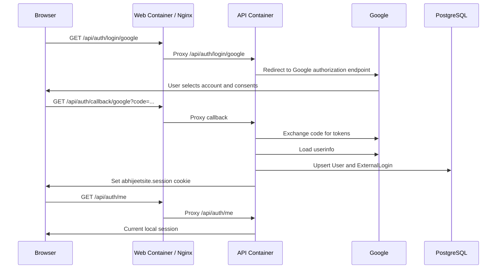

# Google Login Runbook

This document explains how Google login works in this website, how to configure it
in Google Cloud and Azure Container Apps, and why the production callback fixes are
needed.

## Architecture

The site uses API-owned OAuth. React never receives Google tokens and never stores
OAuth secrets. The browser only navigates to an API login endpoint, and the API
establishes a local HTTP-only cookie session after Google verifies the user.



| Decision | Choice | Reason |
|---|---|---|
| OAuth owner | API | Keeps Google client secret and provider tokens out of React. |
| Session | Secure HTTP-only cookie | Avoids browser token storage and works with same-origin `/api` calls. |
| Local identity | `User` plus `ExternalLogin` | Allows Google now and LinkedIn later without changing app user IDs. |
| Admin bootstrap | Configured email allowlist | Keeps admin policy local to the app instead of scattering provider checks. |
| Production origin | `Auth__PublicOrigin` | Makes OAuth callback generation deterministic behind Azure/Nginx proxies. |

## Runtime Endpoints

| Endpoint | Owner | Purpose |
|---|---|---|
| `GET /api/auth/login/google` | API endpoint | Starts the Google challenge. |
| `GET /api/auth/callback/google` | ASP.NET OAuth middleware | Receives Google's authorization code callback. |
| `GET /api/auth/me` | API endpoint | Returns anonymous or authenticated session state to React. |
| `POST /api/auth/logout` | API endpoint | Clears the local session cookie. |

The callback route is not manually mapped as a normal endpoint. It is owned by the
ASP.NET Core OAuth handler through `options.CallbackPath`.

## Google Cloud Portal Setup

Use one OAuth client for production if you only want to test on
`abhijeethaval.com`. Create a separate OAuth client for localhost later if local
interactive login is needed.

1. Open the [Google Cloud Console](https://console.cloud.google.com/).
2. Select or create the project for the website.
3. Go to **APIs & Services** -> **OAuth consent screen**. In some console layouts
   this appears under **Google Auth Platform**.
4. Configure the consent screen:
   - **App name**: public website name.
   - **User support email**: your Google account.
   - **Developer contact information**: your email.
   - **Authorized domains**: `abhijeethaval.com`.
   - **Publishing status**: `Testing` is fine while only you use it.
   - **Test users**: add `abhijeethaval@gmail.com` if the app remains in testing.
5. Go to **APIs & Services** -> **Credentials**.
6. Click **Create credentials** -> **OAuth client ID**.
7. Choose **Application type**: `Web application`.
8. Add the authorized redirect URI exactly:

```text
https://abhijeethaval.com/api/auth/callback/google
```

9. Copy the generated client ID and client secret.

Google redirect URIs are exact-match values. Scheme, host, path, and trailing slash
must match the value the app sends. These are different values:

| Correct | Incorrect |
|---|---|
| `https://abhijeethaval.com/api/auth/callback/google` | `http://abhijeethaval.com/api/auth/callback/google` |
| `https://abhijeethaval.com/api/auth/callback/google` | `https://abhijeethaval.co/api/auth/callback/google` |
| `https://abhijeethaval.com/api/auth/callback/google` | `https://abhijeethaval.com/api/auth/callback/google/` |

## Azure Portal Setup

Configure these settings on the API Container App, not the Web Container App.
In this repo the API app is `aca-abhijeet-site`, and the Web app is
`aca-abhijeet-site-web`.

### API Environment Variables

In the Azure Portal:

1. Open the API Container App.
2. Go to **Application** -> **Containers**.
3. Select **Edit and deploy** to create a new revision.
4. Select the API container.
5. Open **Environment variables**.
6. Add or update:

| Name | Value | Secret? |
|---|---|---|
| `Auth__PublicOrigin` | `https://abhijeethaval.com` | No |
| `Auth__Google__ClientId` | Google OAuth client ID | No |
| `Auth__Google__ClientSecret` | Secret reference containing Google client secret | Yes |
| `Auth__AdminEmails__0` | `abhijeethaval@gmail.com` | No |
| `Auth__DataProtectionKeysPath` | Durable mounted path, for example `/mnt/auth-keys` | No |

7. Save and create the new revision.
8. Go to **Revision management** and confirm the new API revision receives traffic.

Container App environment variable edits create a new revision. A stale revision can
continue serving old OAuth configuration if traffic is not moved.

### API Secret

Use an Azure Container Apps secret or a Key Vault reference for
`Auth__Google__ClientSecret`.

Portal flow:

1. Open the API Container App.
2. Go to **Settings** -> **Secrets**.
3. Add a secret such as `google-client-secret`.
4. Go back to **Application** -> **Containers** -> **Edit and deploy**.
5. Add `Auth__Google__ClientSecret` as an environment variable that references the
   secret.
6. Create the new revision.

Changing a secret value alone does not prove the running app restarted with the new
value. Restart the active revision or create a new revision when rotating secrets.

### Data Protection Key Storage

ASP.NET Core protects the OAuth correlation state and the local auth cookie with
Data Protection keys. In production those keys must survive container restarts,
revision swaps, and scale-out. If each replica has different keys, OAuth callbacks
can fail after Google redirects back.

Recommended Azure shape:

1. Create or reuse a Storage Account.
2. Create an Azure Files share, for example `auth-keys`.
3. In the Container Apps Environment, add the Azure Files storage configuration.
4. In the API Container App revision, add an Azure Files volume.
5. Mount that volume into the API container, for example at `/mnt/auth-keys`.
6. Set:

```text
Auth__DataProtectionKeysPath=/mnt/auth-keys
```

The API intentionally fails startup in production when Google credentials are set
without `Auth__DataProtectionKeysPath`. Failing fast is better than letting login
work intermittently.

### Web Container Proxy Settings

The Web container serves React through Nginx and proxies `/api/*` to the internal
API app. The relevant Nginx settings are:

```nginx
proxy_set_header Host $proxy_host;
proxy_set_header X-Forwarded-Host $host;
proxy_set_header X-Forwarded-Proto https;
proxy_ssl_server_name on;
proxy_ssl_name $proxy_host;
```

These settings preserve the public browser-facing host and scheme while still
handshaking correctly with Azure Container Apps internal HTTPS ingress.

The API-side `Auth__PublicOrigin` normalization is still required because OAuth
uses the callback URI in more than one phase. It removes reliance on proxy headers
for auth endpoints.

## Code Walkthrough

### API Configuration Model

`src/AbhijeetSite.Api/Features/Identity/IdentityAuthenticationOptions.cs`
defines the `Auth` configuration section:

| Property | Purpose |
|---|---|
| `Google.ClientId` | Google OAuth client ID. |
| `Google.ClientSecret` | Google OAuth client secret. |
| `PublicOrigin` | Public browser origin used for auth redirects and callback processing. |
| `DataProtectionKeysPath` | Durable key directory for Data Protection. |
| `AdminEmails` | Verified emails granted the local `AdminOnly` policy. |

ASP.NET Core maps double-underscore environment variables into nested config keys,
so `Auth__Google__ClientSecret` maps to `Auth:Google:ClientSecret`.

### Authentication Registration

`src/AbhijeetSite.Api/Features/Identity/IdentityServiceCollectionExtensions.cs`
registers the auth stack:

- Forwarded headers for proxy-aware request scheme and host.
- Data Protection with application name `AbhijeetSite.Api`.
- Cookie auth with:
  - cookie name `abhijeetsite.session`
  - `HttpOnly`
  - `SameSite=Lax`
  - `SecurePolicy=Always` outside development
  - 8-hour sliding session
- Google OAuth when both client ID and secret are configured.
- `AuthenticatedUser` and `AdminOnly` authorization policies.

Google OAuth uses:

| Setting | Value |
|---|---|
| Callback path | `/api/auth/callback/google` |
| Authorization endpoint | `https://accounts.google.com/o/oauth2/v2/auth` |
| Token endpoint | `https://oauth2.googleapis.com/token` |
| User info endpoint | `https://openidconnect.googleapis.com/v1/userinfo` |
| Scopes | `openid`, `profile`, `email` |
| PKCE | enabled |
| Save tokens | disabled |

`SaveTokens=false` is intentional. The app needs a local session, not long-term
Google API access.

### Public Origin Normalization

Production runs behind Azure Container Apps and Nginx. Without normalization,
ASP.NET can see the internal request as HTTP or with an internal host. That caused
these real failures:

| Symptom | Cause | Fix |
|---|---|---|
| `redirect_uri=http://abhijeethaval.com/...` | API saw the callback scheme as HTTP. | Set `Auth__PublicOrigin` and forward HTTPS. |
| `redirect_uri=https://abhijeethaval.co/...` | Typo in `Auth__PublicOrigin`. | Use exact `.com` origin. |
| Browser `HTTP ERROR 500` on callback | Google accepted the first redirect, but API callback processing still used inconsistent origin during auth handling. | Normalize auth request scheme/host before auth middleware. |

The fix has two layers:

1. `GoogleOAuthRedirectHandler` rewrites the outbound Google authorization URL's
   `redirect_uri` query parameter to use `Auth__PublicOrigin`.
2. `PublicOriginRequestMiddleware` normalizes incoming `/api/auth/*` request
   `Scheme` and `Host` before ASP.NET authentication runs.

`Program.cs` wires the order:

```csharp
app.UseForwardedHeaders();
app.UseIdentityPublicOrigin();
app.UseAuthentication();
app.UseAuthorization();
```

That order matters. The OAuth middleware must see the final public scheme and host.

### Login Endpoint

`IdentityEndpointsExtension.cs` maps `GET /api/auth/login/google`.

The endpoint:

1. Checks whether Google credentials are configured.
2. Normalizes `returnUrl` to a local relative URL only.
3. Returns `Results.Challenge(...)` for the Google auth scheme.

The relative-only `returnUrl` check prevents open redirects.

### Google Ticket Handling

`GoogleOAuthTicketHandler.cs` runs after the authorization code is exchanged.

It:

1. Requires an access token from Google.
2. Calls Google's userinfo endpoint.
3. Maps `sub`, `name`, `email`, `email_verified`, and `picture`.
4. Rejects incomplete or unverified identity data.
5. Calls `ExternalLoginUpsertHandler`.
6. Creates the local claims principal.

Provider tokens are not returned to React and are not stored.

### Local User Upsert

`ExternalLoginUpsertHandler.cs` owns local identity persistence:

1. If the Google provider subject already exists, update sign-in metadata.
2. If the verified email already maps to a local user, link Google to that user.
3. Otherwise create a new local `User` and `ExternalLogin`.
4. Mark `IsAdmin` if the verified email is in `Auth:AdminEmails`.

Business failures use the repo's `Result<T>` pattern. EF persistence failures are
wrapped instead of leaking database exceptions into the domain flow.

### Current User and Logout

`GET /api/auth/me` returns:

```json
{
  "isAuthenticated": true,
  "user": {
    "id": "...",
    "displayName": "Abhijeet Haval",
    "email": "abhijeethaval@gmail.com",
    "avatarUrl": "...",
    "isAdmin": true
  }
}
```

Anonymous users receive:

```json
{
  "isAuthenticated": false,
  "user": null
}
```

`POST /api/auth/logout` clears the local app session cookie.

### React Integration

React stays intentionally thin:

| File | Responsibility |
|---|---|
| `src/AbhijeetSite.Web/src/features/auth/authApi.ts` | Builds relative `/api/auth/*` URLs. |
| `src/AbhijeetSite.Web/src/features/auth/AuthStatus.tsx` | Loads current user, renders sign-in/sign-out state. |
| `src/AbhijeetSite.Web/src/features/auth/types.ts` | Defines the auth response/session UI types. |
| `src/AbhijeetSite.Web/src/shared/api/apiClient.ts` | Sends same-origin requests with credentials. |
| `src/AbhijeetSite.Web/src/shared/navigation/SiteHeader.tsx` | Places auth state in the header. |

`apiClient` uses:

```ts
credentials: 'same-origin'
```

That is required so the browser sends the local session cookie to `/api/auth/me`
and `/api/auth/logout`.

## Verification

### Production Smoke Test

1. Open a fresh browser session or incognito window.
2. Go to `https://abhijeethaval.com`.
3. Click **Sign in**.
4. Select the Google account.
5. Confirm the browser returns to `https://abhijeethaval.com`.
6. Confirm the header shows the signed-in user and **Sign out**.
7. Visit `https://abhijeethaval.com/api/auth/me`.
8. Confirm `isAuthenticated` is `true`.
9. Click **Sign out**.
10. Confirm `/api/auth/me` returns anonymous state.

Do not refresh a Google callback URL containing `code=...`. Google authorization
codes are one-time values.

### Automated Validation

Useful checks after auth code changes:

```powershell
dotnet build src\AbhijeetSite.Api\AbhijeetSite.Api.csproj -c Release --no-restore
dotnet test tests\AbhijeetSite.Api.Tests\AbhijeetSite.Api.Tests.csproj -c Release --no-restore --filter "PublicOriginRequestNormalizerTests|GoogleOAuthRedirectHandlerTests"
```

When Docker/Testcontainers is available but reports API version mismatch:

```powershell
$env:DOCKER_API_VERSION='1.43'
dotnet test tests\AbhijeetSite.Api.Tests\AbhijeetSite.Api.Tests.csproj -c Release --no-restore
```

## Troubleshooting

| Error | Meaning | Fix |
|---|---|---|
| `redirect_uri_mismatch` with `http://...` | API generated HTTP callback. | Set `Auth__PublicOrigin=https://abhijeethaval.com`; deploy API revision. |
| `redirect_uri_mismatch` with wrong domain | Public origin typo. | Fix `Auth__PublicOrigin`; verify Google redirect URI exact match. |
| Google accepts account then callback returns `500` | API failed after callback. | Check API logs for correlation, token exchange, or DB errors. |
| `Correlation failed` | Cookie/state could not be validated. | Verify Data Protection key mount, cookie domain/path, browser did not block cookies, and one revision is active. |
| Startup fails with `Auth:DataProtectionKeysPath must be configured...` | Google creds are present but key storage is missing. | Mount durable storage and set `Auth__DataProtectionKeysPath`. |
| Header still shows signed out after callback | Session cookie not sent to `/api/auth/me`. | Verify same-origin routing, HTTPS, cookie attributes, and `credentials: 'same-origin'`. |
| Works on one revision but not another | Traffic split between stale revisions. | Route 100% traffic to the latest API revision or deactivate stale revisions. |

API logs to inspect in Azure:

1. Open the API Container App.
2. Go to **Monitoring** -> **Log stream**.
3. Select the active API revision.
4. Reproduce login with a fresh flow.
5. Look for authentication, token endpoint, Data Protection, or PostgreSQL errors.

## Security Notes

- Keep Google client secret out of Git and out of React.
- Keep `Auth__Google__ClientSecret` in Azure secrets or Key Vault.
- Keep Data Protection keys on durable storage.
- Do not store Google access tokens unless a future feature genuinely needs Google
  API access.
- Keep `returnUrl` relative-only.
- Add CSRF protection before introducing authenticated mutating endpoints for
  article publishing or comments.
- Prefer one active API revision while changing auth config to avoid split-brain
  cookie/callback behavior.

## Official References

- [Google OAuth 2.0 for web server applications](https://developers.google.com/identity/protocols/oauth2/web-server)
- [Google Cloud OAuth consent configuration](https://support.google.com/cloud/answer/15549257)
- [Azure Container Apps environment variables](https://learn.microsoft.com/en-us/azure/container-apps/environment-variables)
- [Azure Container Apps secrets](https://learn.microsoft.com/en-us/azure/container-apps/manage-secrets)
- [Azure Container Apps revisions](https://learn.microsoft.com/en-us/azure/container-apps/revisions)
- [ASP.NET Core Data Protection configuration](https://learn.microsoft.com/en-us/aspnet/core/security/data-protection/configuration/overview)
