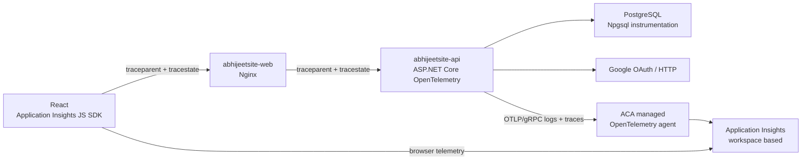

# Observability Runbook

This runbook provisions and validates end-to-end user-journey telemetry for the
production Azure Container Apps deployment. The governing architecture decision is
[0003 - User-Journey Observability Boundary](architecture/0003-user-journey-observability.md).

## Production topology



The browser and API use the same Application Insights resource so `OperationId` can join
their telemetry. The browser role is `abhijeetsite-web`; the API service name is
`abhijeetsite-api`. Nginx forwards W3C context but does not create a span.

## Runtime ownership

| Concern | Owner | Implementation |
|---|---|---|
| Browser page, route, dependency, and JS failure telemetry | Web | `src/AbhijeetSite.Web/src/shared/telemetry/browserTelemetry.ts` |
| Runtime browser destination | Web container configuration | `APPLICATIONINSIGHTS_CONNECTION_STRING` rendered into `/telemetry-config.js` |
| W3C proxy propagation | Nginx | `src/AbhijeetSite.Web/nginx.conf.template` |
| ASP.NET Core, HTTP, runtime, logging, sampling, and OTLP transport | ServiceDefaults | `src/AbhijeetSite.ServiceDefaults/Extensions.cs` |
| Trace privacy and health-noise policy | ServiceDefaults | `src/AbhijeetSite.ServiceDefaults/TelemetryDataProcessor.cs` |
| Use-case spans and structured events | Feature modules | `ArticlesTelemetry`, `ArticlesLog`, `IdentityTelemetry`, and `IdentityLog` |
| PostgreSQL dependency spans | Persistence | Npgsql OpenTelemetry instrumentation with stable span names |
| Unhandled failures | API boundary | `GlobalExceptionHandler` |

## Azure Portal setup

Use one resource set per deployed environment. Production and any future staging
environment must never share an Application Insights resource.

### 1. Create Application Insights

1. In Azure Portal, open **Application Insights** and select **Create**.
2. Select the production subscription and resource group.
3. Use a production-specific name such as `appi-abhijeetsite-prod`.
4. Select the same Azure region as the Container Apps environment where possible.
5. Create or select a Log Analytics workspace dedicated to this environment.
6. After deployment, open **Properties** and confirm **Local Authentication** is enabled.
   The browser SDK and ACA managed OpenTelemetry Application Insights destination require
   local-auth ingestion.
7. Copy the resource **Connection String** from **Overview**. Do not commit it.

The connection string contains a routing identifier rather than an authorization secret,
but it is still deployment configuration. Treat unexpected public ingestion as abuse and
control it with the cap and alerts below.

### 2. Configure the ACA managed OpenTelemetry agent

The agent is configured on the **Container Apps environment**, not on either individual
Container App. The current Azure Portal experience may not expose every managed-agent
setting. Use Cloud Shell with Azure CLI 2.79.0 or later when the portal control is absent:

```bash
az containerapp env telemetry app-insights set \
  --resource-group <RESOURCE_GROUP_NAME> \
  --name <CONTAINER_APPS_ENVIRONMENT_NAME> \
  --connection-string '<APPLICATION_INSIGHTS_CONNECTION_STRING>' \
  --enable-open-telemetry-traces true \
  --enable-open-telemetry-logs true
```

Verify the non-sensitive configuration:

```bash
az containerapp env telemetry app-insights show \
  --resource-group <RESOURCE_GROUP_NAME> \
  --name <CONTAINER_APPS_ENVIRONMENT_NAME>
```

The environment injects OTLP/gRPC endpoints into the API revision. Do not set
`OTEL_EXPORTER_OTLP_ENDPOINT` or the `CONTAINERAPP_OTEL_*_GRPC_ENDPOINT` variables manually
in production; explicit app settings override the managed values. Application metrics are
not sent to Application Insights by this managed destination. Continue to use ACA platform
metrics in production and Aspire metrics locally.

### 3. Configure browser ingestion

On the public Web Container App:

1. Open **Settings > Environment variables**.
2. Add `APPLICATIONINSIGHTS_CONNECTION_STRING` with the same production Application
   Insights connection string.
3. Create a new revision and confirm it becomes active.

Do not add this variable to the API Container App. The API exports only to the managed
agent's injected OTLP endpoint. At web-container startup, the entrypoint renders the value
into a small public JavaScript configuration file. An empty value disables browser export,
which is the intended local-development behavior.

### 4. Configure retention and ingestion safeguards

1. Open the linked **Log Analytics workspace > Usage and estimated costs > Data
   Retention** and set interactive retention to **90 days**.
2. Under **Usage and estimated costs > Daily cap**, enable a **0.1 GB/day** cap.
3. Configure the Application Insights cap to the same value if the resource exposes a
   separate cap. The effective cap for a workspace-based resource is the lower setting.
4. Create an action group owned by the site operator. Enable both fired and resolved
   notifications.
5. Create ingestion alerts at **0.08 GB/day (80%)** and when the daily cap stops
   collection.

The cap is an emergency brake, not a normal filtering mechanism. After 14 production days,
set it to `max(0.1 GB, 5 x P95 daily ingestion)` and document the measured baseline.

### 5. Configure production alerts

Create these alerts in Application Insights and route each one to the owner action group:

| Alert | Window / threshold | Notes |
|---|---|---|
| Standard availability test | Every 5 minutes, 5 locations, 5-second timeout; alert when 3 of 5 locations fail | `GET https://<PUBLIC_HOST>/api/articles`, expect HTTP 200, enable retries and SSL validation |
| Server failures | 3 server responses with status `500-599` in 5 minutes | Split by API cloud role when building the rule |
| PostgreSQL dependency failures | 3 failed PostgreSQL dependencies in 5 minutes | Filter to the PostgreSQL dependency type and API cloud role |

Use **Application Insights > Availability > Add Standard test**. Do not create a deprecated
URL ping test. Defer latency alerts until the 14-day baseline exists.

## Validation

### Local

Run the full application through Aspire and perform one article journey:

```powershell
dotnet run --project src\AbhijeetSite.AppHost
```

1. Open the Aspire dashboard.
2. Navigate from the article list to an article detail page.
3. Confirm the API request has the expected article use-case child activity and PostgreSQL
   dependency.
4. Confirm logs carry trace and span identifiers.
5. Confirm no query strings, SQL, article content, email, cookies, tokens, or authorization
   headers appear.

Browser export remains disabled locally unless a runtime connection string is deliberately
provided. Automated tests never send telemetry to Azure.

### Production smoke test

After both revisions and the managed agent are active:

1. In a private browser window, visit the production home page.
2. Open the article list and one article detail page.
3. In Application Insights, open **Transaction search** and filter to the last 30 minutes.
4. Open the browser dependency for `/api/articles` and confirm the transaction contains the
   `abhijeetsite-api` request, an `articles.*` use-case span, and a PostgreSQL dependency.
5. Confirm the browser and API records have the same `OperationId`.
6. Verify `/health`, `/alive`, static assets, and `telemetry-config.js` do not dominate the
   result set.
7. Verify the Standard availability test succeeds from all five locations.

Useful workspace queries:

```kusto
AppRequests
| where TimeGenerated > ago(30m)
| where AppRoleName == "abhijeetsite-api"
| project TimeGenerated, OperationId, ParentId, Name, ResultCode, Success, DurationMs
| order by TimeGenerated desc
```

```kusto
AppDependencies
| where TimeGenerated > ago(30m)
| where AppRoleName == "abhijeetsite-api"
| project TimeGenerated, OperationId, ParentId, Name, DependencyType, Success, DurationMs
| order by TimeGenerated desc
```

```kusto
AppTraces
| where TimeGenerated > ago(30m)
| where AppRoleName == "abhijeetsite-api"
| project TimeGenerated, OperationId, ParentId, SeverityLevel, Message
| order by TimeGenerated desc
```

Use the `OperationId` from a browser dependency or page view to narrow each query. If a
workspace exposes Application Insights compatibility table names, use `requests`,
`dependencies`, `traces`, and `pageViews` for the equivalent queries.

## Failure behavior

Telemetry delivery is fail-open. The app remains healthy when the managed agent or
Application Insights is unavailable. The managed agent buffers and retries in memory for
up to five minutes, then drops old batches rather than growing without bound. Agent health
is not currently available as an ACA health signal, so do not add it to `/health` or
`/alive`.

